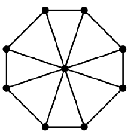

# Java-Laboratory
 Homework and Projects from the Java Laboratory  

Name: Samson Ioan-Paul  
Group: 2A6  

# Laboratory2

# Compulsory2
An instance of the Room Assignment Problem consists of events and rooms. Events may be courses, labs, seminars, etc. Rooms may be lecture halls, computer labs, etc.  
Each event has a name, a number of participants (its size), a start time and an end time.  
Each room has a name, a type and a capacity.  
We consider the problem of assigning a room to each event such that the constraints are satisfied and the number of used rooms is as small as possible (if possible).  
Create an object-oriented model of the problem. You should have (at least) the following classes: Event, Room.  
The start and end time will be integers. The rooms will also have the property type. The available types will be implemented as an enum .  
Each class should have appropriate constructors, getters and setters.  
The toString method form the Object class must be properly overridden for all the classes.  
Create and print on the screen the objects in the example.  

We create two classes, Event and Room, as well as two enums, EventType and RoomType, which contain the available types for each of the two classes respectively.  
The Event class has a name, which is actually an EventType, a capacity (int), and a startTime and an endTime, which are LocalTime objects.  
The Room class has a name (String), a type (RoomType) and a capacity (int).  
Each of the classes has the appropiate constructors, and getters and setters for each attribute.  
The method toString is overrited appropiately in both classes, and in order to print the type of a certain Event/Room we use a switch statement and print the string corresponding to that specific EventType/RoomType respectively.  

# Homework2
Create a class that describes an instance of the problem.
Override the equals method form the Object class for the Event, Room classes. The problem should not allow adding the same event or room twice.
Instead of using an enum, create dedicated classes for lecture halls and computer labs. Room will become abstract. The course room may have an additional property indicating if there is a video projector, and the lab room may indicate the operating system of its computers.
Create a class to describe the solution.
Implement a simple algorithm for creating a feasible solution to the problem, "trying" to minimize the number of used rooms.
Write doc comments in your source code and generate the class documentation using javadoc.

We create the Instance class, with has two attributes, a list of events, and a list of classes. 
We override the equals method in both Event and Room classes, and we only add an event/ a room if it's list doesn't already contain it, otherwise we throw an exception.
For each of the Room Types we create a different class with extends Room, thus making the Room class abstract.
A solution for the problem is a simple mapping from each event to a room, whilst trying to minimize the number of rooms used.
The algorithm sorts both the Event and Room lists in descending order of the sizes and capacities respectively. We first go through each room, creating a list for each one, then we go through the events in a nested loop, checking if the currentEvent fits in the currentRoom (it's size is less than the room's capacity), and also checking for that room's eventsList that it doesn't have any other event that goes over the current one, and if the event hasn't been attributes to a room yet. 
This way we obtain a mapping from each room to a list of compatible events, minimizing the number of rooms used. Afterwards we switch the order of the map, mapping the events to the rooms instead. If the number of events that we got at the end is the same as the one from the start we have a solution and we print it, otherwise we don't have any solution. The time complexity of the algorithm is O(numberOfEvents * numberOfRooms).

# Bonus2
Implement the DSatur graph coloring algorithm.
Generate large random instances and:
compare the solutions generated by Greedy and DSatur algorithms;
analyze the performance of your algorithm (running times, memory consumption). Identify the hot-spots in your code.

We create a graph class that keeps in mind the adjacency lists for each node, then we procees to either generate a random list or input a list of edges. The graph is created from that list of edges.
We implement the greedy coloring algorithm, which gets a permutation of the nodes and the graph as an instance and, at every step, it choses the smalles possible color from the set of colors such that there are no adjacent nodes with the same color. (time: O(n^2) -- we iterate through the nodes twice, space: O(2*n) -- the checking and result lists).
We implement the DSatur coloring algorithm, which instead of doing basically a random search (because of the random permutation), we get the elements as such:
1. we get a list of pairs between nodes and their respective degrees, and we sort it in descending order of the degrees (time: O(nlog(n)), space: O(2*n))
2. for the first element in the list we created, we initialize it with the first color and we increment it's adjacent nodes saturation (time: O(n))
3. we get the maxSaturation from the remaining (uncolored) nodes (time: O(n))
4. we iterate through the previous list and we search for nodes which have the saturation equal to maxSaturation and are not colored (this way, we choose the most saturated uncolored node, and in case there are more, we get the first one with the highest degree) -- we get the 'currentNode' (time: O(n))
5. we increment the saturation of the currentNode's neighbors and we look for a suitable color for it (just like we did on the greedy algorithm) (time: O(n), space O(2*n) -- like the greedy algorithm)

Steps 3, 4 and 5 are encapsulated in a O(n) time, since we need to check each node in the graph. So the total time complexity is O(n^2), and the space complexity is O(4*n).
We can see the time complexities don't differ, but the DSatur algorithm does better than the Greedy algorithm in some cases, being on par with it in other cases.
The DSatur algorithm is guaranteed to get the minimum number of colors used for Wheel Graphs, Cycle Graphs, Bipartite Graphs, while the Greedy algorithm can sometimes get more than the minimum. Here's an exapmle from a run on a Wheel Graph:

Greedy Algorithm: (permutation: [7, 0, 4, 5, 6, 8, 1, 2, 3])
Number of colors used: 4
Node: 0, color: 1
Node: 1, color: 0
Node: 2, color: 1
Node: 3, color: 2
Node: 4, color: 0
Node: 5, color: 1
Node: 6, color: 2
Node: 7, color: 0
Node: 8, color: 3

DSatur Algorithm: 
Number of colors used: 3
Node: 0, color: 1
Node: 1, color: 2
Node: 2, color: 1
Node: 3, color: 2
Node: 4, color: 1
Node: 5, color: 2
Node: 6, color: 1
Node: 7, color: 2
Node: 8, color: 0

